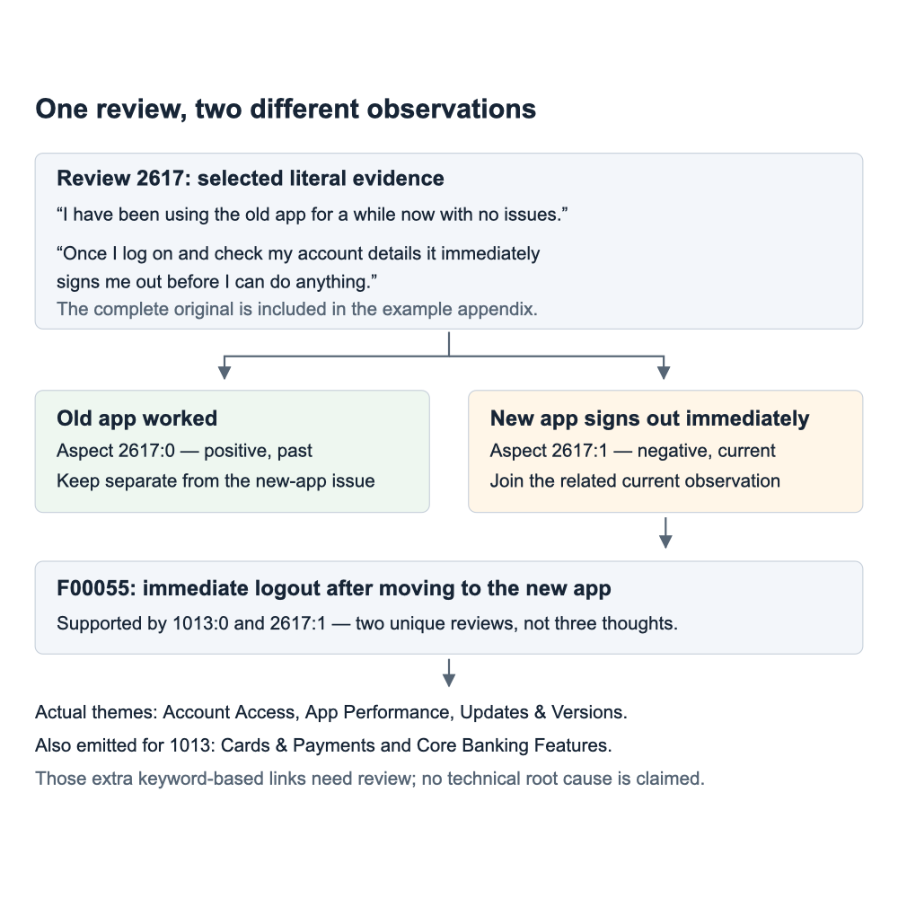
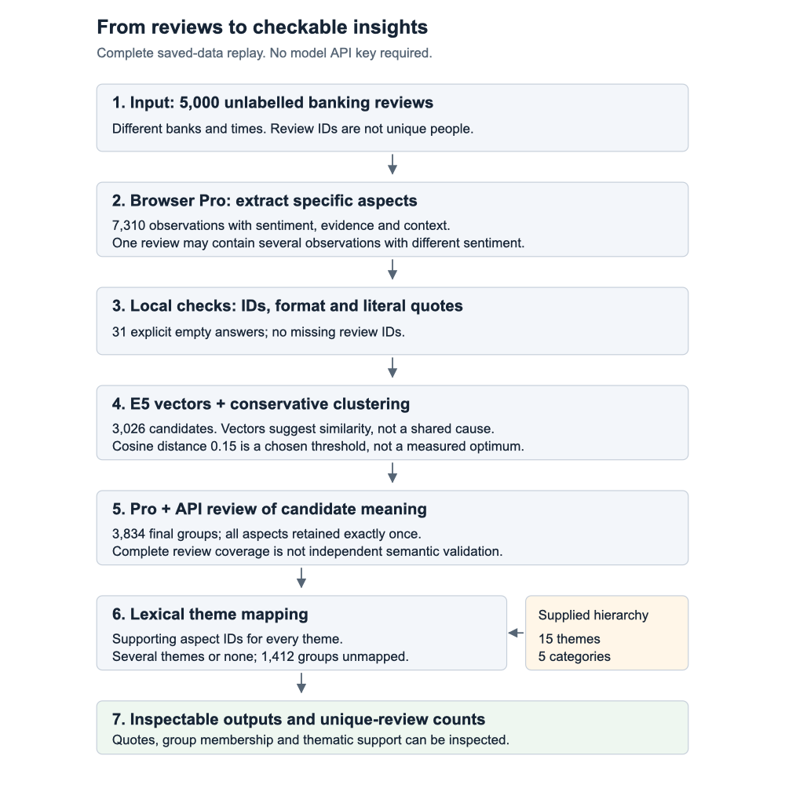
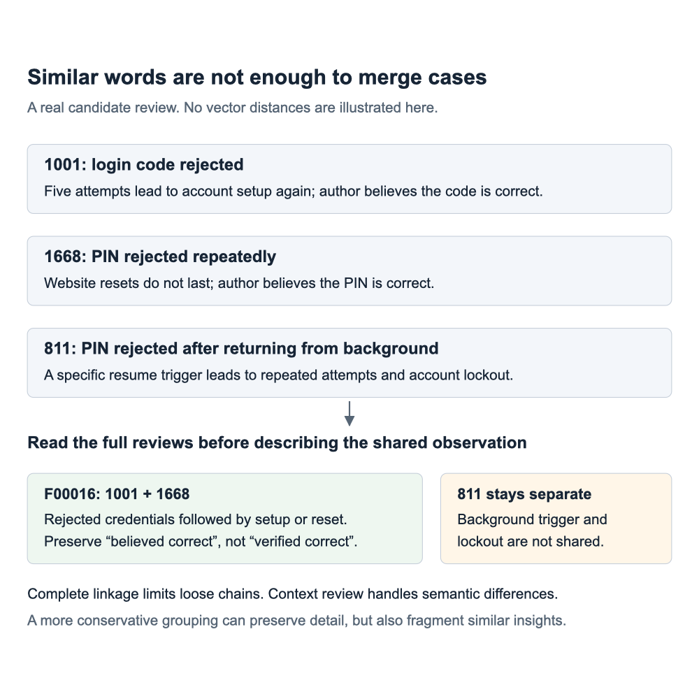

# Chattermill: понятный разбор финального решения

**Новые аналитические графики:** [облако аспектов, пороги кластеризации и сравнение поиска](DIAGNOSTICS_V2.md). Это рабочая диагностика v2; смысловой mapping и человеческая оценка ещё не выполнены.

Понятный разбор задачи, подхода и результатов. [English report](REPORT_EN.md).

Публичная документация: код, ключи, переписка и материалы для подготовки к интервью здесь не размещены.

## 1. Что вообще нужно было сделать

Представь продуктовую команду банка. У неё тысячи отзывов. «Приложение плохое» не помогает выбрать, что исправлять. Полезнее увидеть: «после перехода на новую версию сразу заканчивается сессия, поэтому человек не может выполнить действие» — и открыть отзывы, подтверждающие это.

[Задание](https://github.com/chattermill/llm-challenge/blob/8ab5811999692cac9e9de238cd8061e8b7c27d83/README.md) просит извлечь конкретные мысли с sentiment, организовать их в инсайты, сопоставить с готовыми темами и оценить результат. Дано 5 000 текстов **без правильных ответов**. То есть у нас нет 5 000 объектов с известным классом и мы не обучаем обычный классификатор на 15 классов.

Работодатель просит код, результаты этапов, оценку и README с запуском, упакованные в ZIP. Его акцент — понятные решения, а не огромная платформа. Для следующего этапа предусмотрена презентация примерно на 10 минут. Публичный README не описывает скрытый benchmark или точные веса оценки.

Само тестовое — банковский пример более широкой задачи анализа обратной связи. Наш результат не доказывает причины багов банка и не является внедрённым продуктом Chattermill.

## 2. Главная идея на одном реальном примере

Отзыв **2617**:

> I have been using the old app for a while now with no issues. Having been advised that the old app will no longer be valid  I have downloaded the new version. Once I log on and check my account details it immediately signs me out before I can do anything. No use whatsoever !

Здесь нельзя поставить один общий sentiment и закончить. Есть две мысли:

- старое приложение работало нормально — positive, past
- новое сразу выводит из аккаунта — negative, current

В отзыве **1013** тоже описан немедленный logout. Объединяем две текущие негативные мысли. Похвалу старому приложению не добавляем в эту группу.

**Важная оговорка:** мы говорим о похожем пользовательском сценарии, а не об одном установленном баге токена авторизации. У нас нет кода и логов банка.

English: “I separate observations inside a review. Praise for the old version should not cancel a current complaint about the new one.”

## 3. Отзыв, аспект, инсайт, тема — чем отличаются

«Единица анализа» означает только **что именно сейчас рассматриваем или считаем**. Это не дополнительный алгоритм.

| Название | По-простому | На примере |
|---|---|---|
| Review | Весь отзыв | Старое работало, новое сразу выводит |
| Aspect | Одна конкретная мысль | Новое приложение сразу выводит — negative |
| Insight | Описание, поддержанное участниками группы | Немедленный logout после перехода на новую версию |
| Theme | Широкая рубрика из задания | Account Access |
| Category | Родитель рубрики | Account Management |

Группа может быть похвалой, одиночным случаем или общей оценкой. Поэтому **3 834 группы не означают 3 834 доказанные массовые проблемы**.

Темы не нужно придумывать: даны 15 тем и 5 категорий. Их используем после формирования групп. Задание не запрещает буквально показывать темы раньше; позднее сопоставление — наш выбор, чтобы сначала сохранить конкретику.

| Category | Themes |
|---|---|
| Account Management | Account Access, Account Settings, Cards & Payments |
| Online Experience | App Performance, Updates & Versions, Navigation & Design |
| Customer Service | Response Time, Issue Resolution, Staff Behaviour |
| Product & Features | Core Banking Features, New Features, Integrations |
| Company & Brand | General Satisfaction, Trust & Security, Pricing & Fees |

Несколько тем допустимы, но каждой нужны свои подтверждения. Нет подходящей темы — не заставляем модель выбирать любую. Не выдаём сходство векторов за вероятность 0.8: калибровки вероятностей не было.

## 4. Как работает полный проход

### Шаг 1. Pro извлекает мысли

В браузерном Pro получены сохранённые ответы для всех отзывов. Получилось **7 310 аспектов**. В 31 отзыве ответ явно пустой. Это обработанные записи, не потерянные запросы; однако модель могла пропустить содержательную мысль.

У аспекта шесть смысловых полей. Это **наш формат**, а не шесть требований работодателя:

| Поле | Зачем |
|---|---|
| aspect | Коротко сказать, что произошло или понравилось |
| sentiment | Сохранить отношение именно к этой мысли |
| evidence | Дословная цитата, чтобы проверить утверждение |
| referent | Отличить целевой продукт от конкурента |
| time | Отличить действующее от прошлого или исправленного |
| attribution | Отличить личный опыт от пересказа |

Контекст тоже предсказывает модель. Наличие поля само по себе не гарантирует правильность.

Например, **27** хвалит быстрые переводы Starling и критикует задержки других банков. Негатив конкурентов нельзя считать негативом Starling. В **775** клиент спорит с сообщением о плохом соединении. Мы не можем превратить его уверенность в установленный факт «интернет точно исправен».

### Шаг 2. Код проверяет сохранённый ответ

Все ID должны присутствовать, цитаты — встречаться в рабочем тексте, значения полей — быть допустимыми. Проверка дословности означает, что цитата не выдумана; она не доказывает правильность интерпретации.

ID — номер строки исходного CSV, начиная с нуля. Шесть рабочих текстов редактировались для уменьшения персональных данных; цитаты проверяются по сохранённому рабочему корпусу.

### Шаг 3. Векторы предлагают группы

E5-small-v2 превращает формулировки аспектов в векторы. Близкие векторы помогают найти разные способы описать похожую ситуацию.

Complete linkage объединяет группу только при достаточной близости даже самой далёкой пары. Это защита от цепочки «A похож на B, B на C — значит всё одно». При cosine distance 0.15, с разделением по контексту, получились **3 026 кандидатов**.

Порог 0.15 — консервативный выбор. Мы не доказали, что это оптимум.

### Шаг 4. Модель проверяет смысл групп

Pro проверил первоначальную часть. API-проход завершил оставшиеся кандидаты. Модель читала полные отзывы, отделяла разные сценарии, сохраняла единичные случаи.

Теперь **непроверенных кандидатов нет**: 7 310 аспектов распределены ровно по одному разу между 3 834 группами. 16 отвергнутых гипотез оставлены для проверки истории, но не получают темы. Модельное ревью — не человеческий gold, то есть не независимый эталон.

Векторы предложили близкие наблюдения о PIN. Но отказ после возвращения приложения из background и lockout в **811** оставили отдельно от setup/reset в **1001 и 1668**. Общий инсайт говорит «коды, которые авторы считают правильными», а не «технически подтверждённые правильные коды».

Разные первоначальные кандидаты затем не объединяли. Поэтому одна проблема может остаться в нескольких группах — сознательно принимаем раздробленность, но не называем её преимуществом без оценки.

### Шаг 5. Словарные правила назначают темы

**В финальной сдаче mapping словарный, не LLM.** Например, login и PIN могут активировать Account Access. Сохраняем сработавшие слова, аспекты и поддерживающие отзывы.

Это понятно и воспроизводимо, но слабее полноценного смыслового сопоставления. Синоним можно пропустить, а случайное слово — принять за важную тему. **1 412 групп без темы** — не доказательство, что они описывают новые темы.

Полный LLM-mapper реализован и проверен на формат, но его большой прогон **не запускался**. Этот этап не выдаём за завершённый эксперимент.

## 5. Гипотезы: что думали → что проверили → что поняли

### Нужно ли скрывать темы при извлечении?

Предполагали, что готовые рубрики могут подавлять необычные детали. На одинаковых 50 отзывах сравнили три отдельных ответа: темы видны, темы скрыты, сначала выделяются смысловые фрагменты.

Получили **134, 141 и 146 аспектов**. Больше записей не означает лучше: есть и пропуски, и лишнее дробление. Сильную гипотезу «видимые темы обязательно подавляют необычное» не подтвердили. Выбрали скрытые обязательные рубрики плюс объединение связанных деталей внутри полного отзыва.

Это диагностика на 30 пилотных, 10 коротких и 10 длинных отзывах, не репрезентативная оценка.

### Поиск от готовых тем

Попробовали на всём корпусе:

- **BM25:** ищет совпадающие слова, например login, password, PIN
- **E5:** ищет похожий смысл через векторы
- **RRF:** объединяет позиции в двух списках, не создаёт вероятности

15 тем × 3 метода × top-20 = **900 позиций выдачи**, не обязательно 900 разных отзывов. BM25 и E5 пересекались на 0–8 результатов, в среднем 3.6 из 20.

Вывод: методы находят разные примеры. Мы не размечали релевантность выдачи, поэтому не утверждаем, что гибрид лучше. Поиск полезен для изучения и поиска пропусков; он не заменяет проход по каждому отзыву.

### Насколько широко объединять?

На 146 пилотных аспектах расстояния 0.15, 0.20 и 0.25 дали **84, 42 и 12 групп**. Шире порог — меньше групп, но чаще смешиваются разные ситуации. Выбрали осторожный порог плюс смысловое ревью. Не объявляем количество групп метрикой качества.

### Можно ли просто выбрать ближайшую тему?

Попробовали dense mapping. Account Access получил **4 031 отзыв**, среди которых нашлась нерелевантная похвала инструкциям. Проблема доказана конкретными примерами, а не просто большим числом назначений.

Этот вариант отвергли. Словарный mapping оставили как прозрачный baseline, не как доказанно лучший метод.

### Что означали «задача A» и «12 находок»?

A — старое имя чата, не алгоритм. Pro изучал весь корпус и предлагал конкретные ситуации с цитатами. Получили 12 гипотез и 72 дословно проверенных фрагмента, включая контрастные примеры.

Например, восстановление доступа требует открыть приложение, в которое нельзя войти; при переключении за кодом сбрасывается операция; обязательное обновление несовместимо с устройством. Это идеи для изучения, **не доказанные исчерпывающие группы со статистикой**. В финальном отчёте не нужно заставлять читателя помнить буквы A–F.

## 6. Что видно в пяти проверенных примерах

Проверены все участники пяти выбранных групп: **10 отзывов и 10 аспектов**. [Полные тексты и реальные результаты](docs/EXAMPLES.md) можно открыть. Это выбранные примеры, не случайная оценочная выборка.

| Пример | Что получилось | Честная граница |
|---|---|---|
| 2879, 3259 | Конкретная польза инструкций и подсказок | Не приписываем им отсутствие любых проблем |
| 1001, 1668 | Отказ кодов и setup/reset | Не утверждаем, что PIN объективно был правильным |
| 4527, 4688 | Сохранили positive про ставки внутри жалоб | Banking-тема назначена только одному участнику: mapping неполон |
| 1013, 2617 | Выделили текущий logout отдельно от старой похвалы | Слова transactions и balance добавили лишние широкие связи |
| 679, 1017 | Телефон заменяет ноутбук | Mapping пропускает перефразированный 1017; privacy относится только к нему |

Ещё исправлено одно чрезмерное утверждение: в группе про €25 за доставку карты только один автор говорит о незапрошенной услуге, другой — об опциональной. Описание сужено, исходный ответ сохранён отдельно. Числа и участники не изменились.

Известный пропуск: в **4242** не выделена заключительная похвала контролю финансов. Проверка групп не восстанавливает мысль, отсутствующую в извлечении. Не скрываем это и не заявляем высокий recall.

## 7. Как считаем и что оцениваем

Два аспекта одной темы в одном отзыве дают **один отзыв**. Для категории объединяем ID её тем, не складываем числа. Не считаем число предложений или людей, которых не можем идентифицировать.

В sentiment есть 4 257 positive, 2 687 negative, 313 neutral, ещё 28 mixed и 25 uncertain. Последние два — сохранённая неоднозначность, а не нейтральность. Для строгой оценки по трём классам их нужно отдельно разрешить.

| Проверка | Подтверждает | Не подтверждает |
|---|---|---|
| Все 5 000 ID присутствуют | Нет потерянных записей | Все мысли извлечены |
| Цитаты дословные | Цитата взята из текста | Вывод верно её трактует |
| Аспект ровно в одной группе | Членство целостно | Объединение полезно |
| Поддерживающие ID сохранены | Частоты воспроизводимы | Темы семантически правильны |
| 137 теста и чистый replay | Код и сохранённые результаты воспроизводятся | Высокая NLP accuracy |

Нет человеческого эталона, поэтому **precision, recall и F1 не посчитаны**. Шесть твоих спорных ответов помогли бы уточнить детализацию, но не сделали бы независимый benchmark. Не требуем их для сдачи.

English: “I separate processing coverage from semantic accuracy. The checks make the result inspectable, but they do not prove that every interpretation is correct.”

## 8. Деньги, воспроизведение и готовность

Прокси сообщил **$20 из $20 использовано**. По сохранённым completion usage локальная оценка $15.05, с неопределённым запросом $15.43. Причина расхождения не установлена. Локальная оценка не была доказательством остатка; token counting через этот прокси нельзя считать бесплатным. Новых платных запросов нет, личный ключ не использован.

Replay запускает полный проход из сохранённых ответов. Это **не новая генерация LLM**. Исходное извлечение сделано в браузере; свежий end-to-end API-run не реализован. Этот недостаток объяснён в английском README, не замаскирован словом reproducible.

Финальная проверка ZIP — в протоколе локальной проверки. Работодателю ничего не отправлено автоматически. Подавать нужно по персональной ссылке из письма, не по generic Greenhouse из публичного README.
