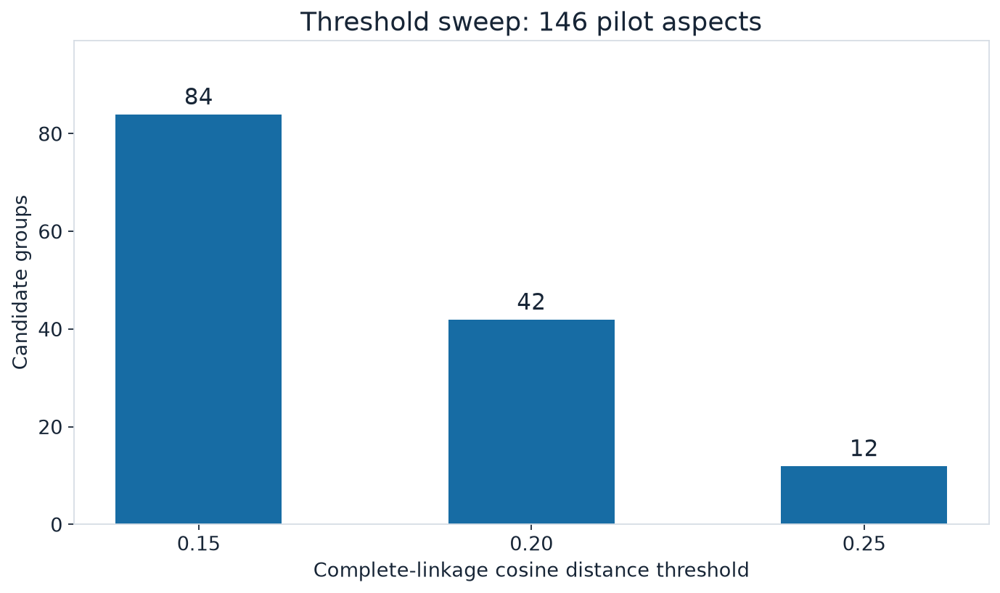
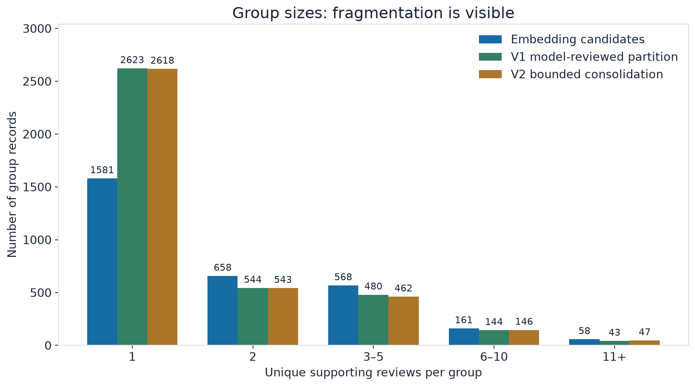
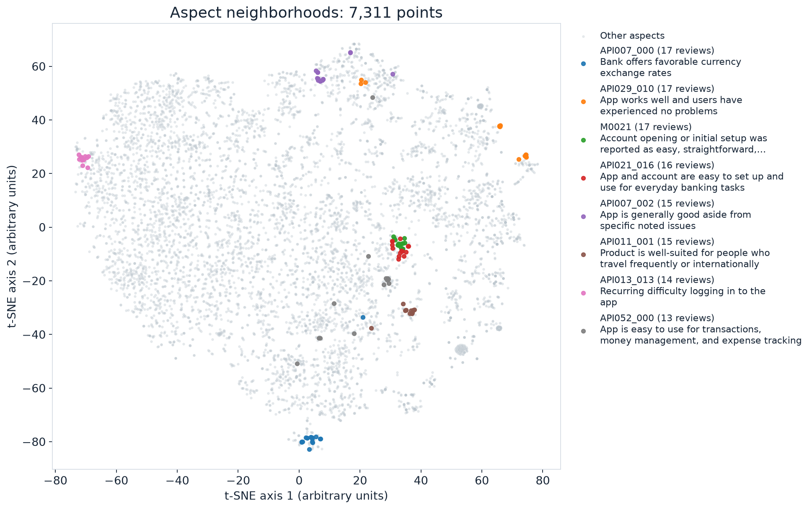
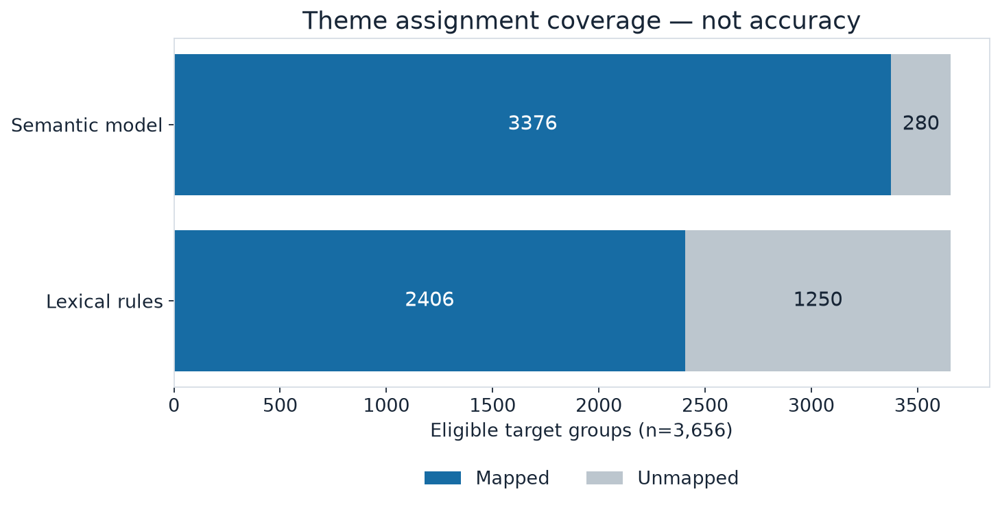
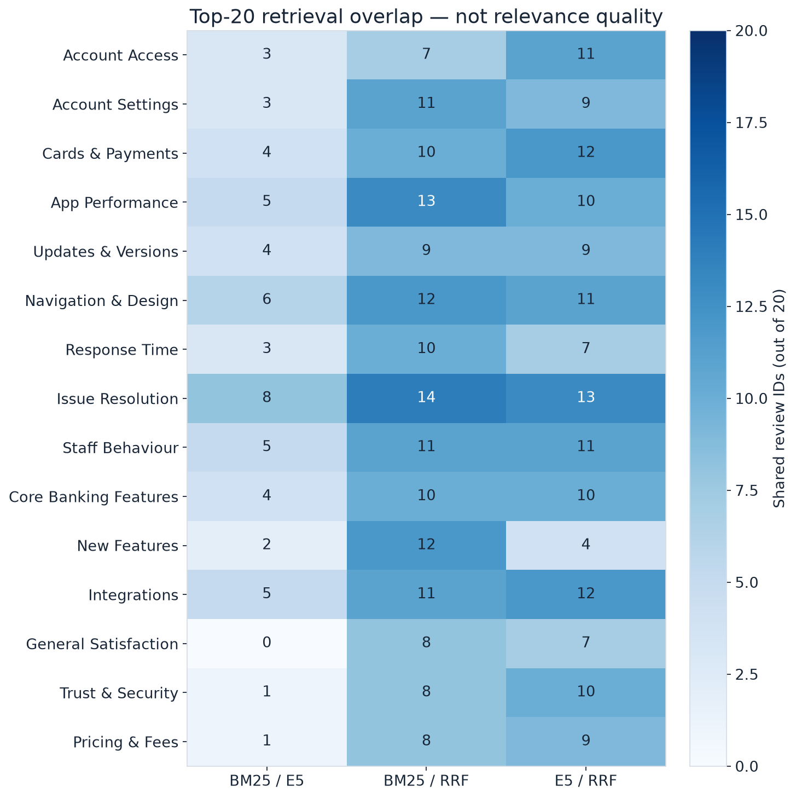

# Chattermill: что мы сделали и что защищаем

Актуальный разбор на **4 октября 2026**. Это материал для твоего финального чтения, а не сообщение о сдаче работодателю. Модельные этапы v2 завершены. Новый ZIP и окончательный английский README ещё нужно собрать и проверить; прежний ZIP содержит v1.

## 1. Задача — не просто распределить отзывы по 15 классам

Даны 5 000 банковских отзывов и справочник из 15 тем, объединённых в 5 категорий. Правильной разметки отзывов нет.

Нужно получить полезную картину обратной связи: выделить конкретные мысли пользователей и их отношение, собрать связанные мысли в понятные инсайты, затем связать их с широкими темами. Например, «приложение плохое» мало помогает продуктовой команде. «После перехода на новую версию сразу заканчивается сессия» уже описывает конкретный сценарий, для которого можно открыть подтверждающие отзывы.

Один отзыв может содержать несколько мыслей, с разным отношением и про разные версии продукта. Поэтому ни один общий sentiment, ни один класс на весь текст не решают задачу целиком.

## 2. Главная идея решения

**Отзыв → отдельные мысли с цитатами → кандидаты групп → смысловая проверка групп → широкие темы → подсчёты и примеры.**

Это последовательность этапов, не обучение новой нейросети.

| Термин | Что он означает |
|---|---|
| Review | Исходный отзыв целиком |
| Aspect | Конкретная мысль внутри отзыва, например жалоба на немедленный выход из аккаунта |
| Sentiment | Отношение к этой мысли: positive, negative или neutral |
| Insight | Понятное утверждение, поддержанное участниками группы; это не обязательно массовая проблема |
| Theme | Широкая рубрика из задания, например Account Access |

### Пример: нельзя смешать старое и новое

В отзыве 2617 пользователь пишет: старое приложение работало без проблем, но новая версия сразу выводит из аккаунта, прежде чем он успевает что-либо сделать.

Получаются две отдельные мысли: похвала прошлой версии и жалоба на текущую. В группу жалоб на немедленный logout идёт только вторая. Похожий сценарий есть в отзыве 1013.

Мы не утверждаем, что установили техническую причину одного и того же бага. Для этого нужны логи и код приложения, которых у нас нет.

**Фраза для защиты:** “I separate observations inside a review. Praise for an old version should not cancel a complaint about the current one.”

## 3. Почему у аспекта есть дополнительные поля

Модель записывает не только краткую мысль и sentiment, но и дословную цитату, объект обсуждения, время и источник опыта. Это наш инженерный формат, а не отдельное требование иметь именно шесть полей.

| Поле | Какую ошибку хотим предотвратить |
|---|---|
| aspect | Не потерять конкретную мысль за общей оценкой |
| sentiment | Не присвоить всем мыслям отношение ко всему отзыву |
| evidence | Не принять утверждение, для которого нет цитаты в оригинале |
| referent | Не перепутать целевой банк с конкурентом |
| time | Не выдать прошлую или уже исправленную проблему за текущую |
| attribution | Не спутать личный опыт с пересказом или предположением |

Поля сами по себе не гарантируют правильность. Цитата может быть дословной, но модель всё равно способна неверно её понять. Поэтому проверка формата и проверка смысла — разные задачи.

## 4. Как получаем группы

Сначала E5-small-v2 превращает формулировку каждой мысли в вектор — набор чисел, описывающий её смысл. Похожие формулировки становятся кандидатами на объединение.

Используем complete-linkage clustering: для объединения недостаточно цепочки похожих соседей, элементы должны быть близки друг к другу по выбранному критерию. Затем учитываем контекст и даём кандидатам смысловую проверку моделью. Она может разделить широкую группу или отвергнуть неподтверждённую мысль.

### Зачем осторожный порог

На пилоте из 146 аспектов пороги cosine distance 0.15, 0.20 и 0.25 дали соответственно 84, 42 и 12 групп. Больший порог объединяет больше, но это не доказательство лучшего результата. Выбрали осторожный 0.15, а не самое красивое число групп. Оптимальность порога не установлена.

### Почему потом понадобилось объединение

После проверки модель часто разделяла кандидатов. Это уменьшало широкие объединения, но оставляло много похожих маленьких групп. В v2 проверили **50 непересекающихся пар** близких групп: модель разрешила 19 объединений и отклонила 31. Получилось 3 816 групп вместо 3 835 в исправленной рабочей копии.

Это ограниченная попытка уменьшить дробление, не глобальное исправление всех групп. Даже принятое объединение может описывать общий пользовательский сценарий, а не одну доказанную техническую причину.

### Что показывает облако точек

Каждая точка — один аспект. Для картинки 384-мерные векторы сжаты с помощью PCA и t-SNE. Цветом выделены восемь крупных групп, ранее помеченных моделью как конкретные повторяющиеся наблюдения.

Картинка помогает выбрать места для проверки. Она не доказывает правильность кластеров: двумерные расстояния искажены проекцией. По красивому облаку нельзя заявить хорошую accuracy.

## 5. Как связываем группы с 15 темами

В v1 работал словарный baseline: ищем характерные слова и выражения. Он дешёвый и понятный, но пропускает перефразировки и может реагировать на слово вне нужного смысла.

В v2 добавили смысловой mapper: модель читает группу и её наблюдения, затем выбирает подходящие темы либо явно отказывается от назначения. У каждой тематической связи сохраняются именно поддерживающие её аспекты и отзывы. Несколько тем допустимы; весь состав группы не приписываем каждой теме автоматически.

Сравнение выполнено **на одних и тех же 3 656 допустимых группах целевого продукта**. Ещё 160 групп исключены из этого сравнения: они отвергнуты или не содержат целевых наблюдений.

| Метод | Получили хотя бы одну тему | Остались без темы | Что измерили |
|---|---:|---:|---|
| Словарный baseline | 2 406 | 1 250 | Покрытие 65.8% |
| Смысловой mapper | 3 376 | 280 | Покрытие 92.3% |

**Мы увеличили покрытие, но не доказали рост точности.** Назначенная тема может быть ошибочной. Отсутствие темы может означать корректный отказ, узкое наблюдение или пропуск mapper. Без независимой разметки нельзя отличить все эти случаи численно.

**Фраза для защиты:** “Semantic mapping covers more groups than the lexical baseline. I do not treat coverage as accuracy.”

## 6. Какие идеи проверили и что из них взяли

| Гипотеза простыми словами | Как проверили | Что наблюдали | Решение |
|---|---|---|---|
| Готовые темы могут скрыть детали отзывов | Диагностические извлечения с таксономией и без неё | Сохранили примеры для сравнения; надёжного численного доказательства преимущества нет | В основном проходе сначала извлекаем конкретные мысли, затем назначаем темы |
| Один отзыв может смешивать прошлое, текущее и разные продукты | Разобрали примеры по цитатам и контексту | Есть случаи, где общий sentiment теряет важное различие | Сохраняем контекст у каждой мысли |
| Широкий порог даст чрезмерные объединения | Пилот с тремя порогами | Число групп сильно меняется; правильность сама по себе не измерена | Осторожные кандидаты и последующая проверка |
| После разделения остаётся избыточное дробление | Ревью 50 близких пар | Модель приняла 19 объединений | Сохраняем ограниченный проход, не называем проблему решённой |
| Словарь недостаточно хорошо понимает перефразировки | Полный смысловой mapping и пересчёт словаря на тех же группах | Больше групп получают тему | Берём смысловой mapping, честно показываем отсутствие оценки accuracy |
| Поиск от тем поможет найти дополнительные примеры | Сравнили BM25, E5 и гибрид RRF | Их top-20 списки различаются | Оставляем как исследовательский инструмент, не как основной способ открытия инсайтов |

Предварительные обсуждения с Pro помогали формировать гипотезы. Ни мнение Pro, ни согласие нескольких моделей не считаем эталоном.

### Идея поиска «от обратного»

BM25 ищет совпадения слов с формулировкой темы. E5 ищет смысловую близость. RRF объединяет позиции в их выдачах, не превращая их в вероятности.

Ячейка — число общих отзывов в двух top-20 списках для одной темы. Это показывает различие найденных примеров, а не качество или распространённость проблемы. Релевантность этой выдачи независимо не размечена.

## 7. Что действительно получилось

| Число | Понятное значение | Чего оно не доказывает |
|---|---|---|
| 5 000 отзывов | Все исходные ID учтены в сохранённом извлечении | Что модель заметила каждую важную мысль |
| 7 311 аспектов | Сохранённые извлечённые мысли после одной цитатно подтверждённой поправки | Что все мысли верны и полны |
| 31 пустой результат | Явно обработанные отзывы без извлечённых аспектов, не потерянные ответы | Что эти отзывы действительно не содержат аспектов |
| 3 816 групп | Итоговые записи после ревью и ограниченного объединения | Что это 3 816 повторяющихся проблем |
| 16 отвергнутых записей | Сохранены для истории, исключены из назначения тем | Что все остальные автоматически правильны |
| 166 локальных тестов | Программные проверки проходят | Смысловую accuracy |
| 12 свежих отзывов через API | Настоящий генеративный проход работает от начала до конца | Что все 5 000 заново сгенерированы через API |

Рабочая v2 добавляет одну пропущенную положительную мысль в отзыве 4242 по точной цитате. Исходная v1 сохранена отдельно. Ни ID, ни старый ZIP не подменены новым результатом незаметно.

## 8. Воспроизводимость и расходы

Полный replay по сохранённым ответам обрабатывает все 5 000 отзывов **без API-ключа и новых платных запросов**. Повторный запуск при заблокированной сети восстановил семь файлов результатов побайтово.

Replay — это воспроизведение обработки сохранённых ответов, а не обещание, что LLM при повторной генерации выдаст те же слова. Свежий генеративный запуск проверен отдельно на 12 отзывах.

Дополнительные API-вызовы v2 имеют расчётную верхнюю оценку **около $2.52** при согласованном максимуме $20. Это расчёт по usage, не invoice и не остаток аккаунта. Старый кредит задания учитывается отдельно. Ключи и личные конфиги не публикуются.

## 9. Что мы не утверждаем

- Независимой человеческой оценки extraction, sentiment и mapping нет. Голосовые комментарии остаются качественным разбором; мы не заполняем недостающие ответы моделью и не выдаём их за human gold
- Возможно, извлечение пропустило детали; проверка точности цитат не находит все пропуски
- Группы могут быть слишком узкими или широкими. Ограниченное ревью пар не устраняет это повсеместно
- Смысловой mapper может ошибочно назначить широкую тему. Более высокое покрытие не равно лучшей accuracy
- Частоту считаем по уникальным поддерживающим отзывам. Это доля в данном корпусе, а не доля всех клиентов банка

Для независимых quality metrics потребовалась бы заранее зафиксированная человеческая разметка с правилами сопоставления. Мы не блокируем текущую упаковку её отсутствием, но явно сохраняем это ограничение.

## 10. Как рассказать за 10 минут

1. **Задача, 1 минута:** нужно сохранить конкретные пользовательские наблюдения, а не только общий sentiment
2. **Подход, 2 минуты:** цитатное извлечение, контекст, кандидаты групп, ревью, поздний mapping
3. **Пример, 2 минуты:** старое приложение работало, новое сразу выводит; почему это две мысли
4. **Эксперименты, 2 минуты:** порог, дробление, ограниченные объединения, словарь против смыслового mapping
5. **Результаты, 2 минуты:** таблица выше, настоящий smoke, offline replay; отдельно покрытие и accuracy
6. **Ограничения, 1 минута:** человеческая оценка, пропуски, границы групп и тем; следующий шаг — независимая проверка, не ещё один огромный pipeline

**Главная формулировка:** “The goal is to preserve specific observations, group them carefully, and connect them to broader themes without losing the evidence.”

## 11. Что требуется от тебя сейчас

Прочитать эту страницу и сказать свободно: где непонятно, какие выводы неубедительны, что ты не сможешь объяснить на защите. Дополнительная массовая разметка не требуется.

Остаётся финализировать английскую документацию, проверить презентационные группы по всем участникам и собрать отдельный ZIP v2 с чистой установкой и replay. Эта страница не означает, что новый ZIP уже проверен или что решение отправлено работодателю.

[Подробные пояснения к графикам](DIAGNOSTICS_V2.md) · [История первоначальной версии v1](README.md)
